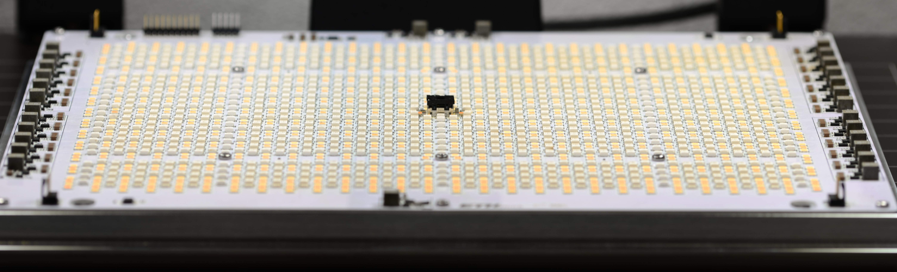
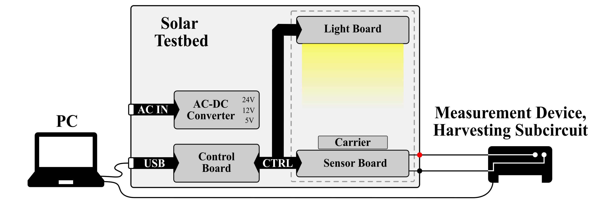

<p align="center">
  
</p>


# Open Source AAA-Grade Solar Testbed
This repository contains the hardware design files for the AAA-grade solar testbed.
It can accurately reproduce both indoor and outdoor lighting conditions, from ultra-low, narrow-band artificial light to full-spectrum sunlight. This enables a stable and repeatable evaluation environment with spectrally configurable illumination, making it ideal for evaluating ultra-low-power energy harvesting systems.

An in-depth analysis of the hardware can be found here: [arXiv.2604.24950 (preprint)](https://arxiv.org/abs/2604.24950)

> <div align="justify"> Energy harvesting promises maintenance-free operation of wireless sensor nodes but introduces strong dependencies on stochastic and deployment-specific environmental conditions. In particular, solar-powered systems are highly sensitive to variations in irradiance and spectral composition, which complicates system-level design, parameter tuning, and reliable verification. This work presents a solar testbed in which active control via Hardware-in-the-Loop (HIL) enables stable and repeatable illumination conditions for evaluating ultra-low-power energy harvesting systems. The proposed LED-based solar testbed provides spectrally configurable illumination over a wide dynamic range, from 5.7 mW/m2 to 908 kW/m2. It achieves Class AAA performance according to IEC 60904-9, with a spectral match below 1.3% and a spatial non-uniformity below 1.28% over a 16.5 cm x 16.5 cm test area. The long-term irradiance instability remains below 0.6%. Closed-loop control using integrated illuminance and spectral sensors ensures high temporal stability, while a temperature-controlled DUT stage supports long-term experiments. Experimental results demonstrate high repeatability and suitability for systematic laboratory characterization of solar energy harvesting systems.</div>

## Key Features
- **Class AAA Solar Simulator** compliant with [IEC 60904-9](https://webstore.iec.ch/publication/28973)
- **Spectrally tunable LED light source** composed of eight different LED types allows for emulation of natural and artificial light sources
- **Wide irradiance range** from **5.7 mW/m² to 908 W/m² (~1 lx to 110 klx)**
- **Large uniform illumination area** of 16.5 cm × 16.5 cm
- **Temperature-controlled platform** to keep the device under test (DUT) at a constant temperature

## Ussage
The solar testbed is designed to operate as part of a laboratory measurement setup in which a host computer, the testbed itself, and external measurement instruments interact closely. A computer connects to the testbed via USB and acts as the central orchestration unit. It configures and controls the illumination conditions, such as intensity and spectral composition, and coordinates the timing and execution of experiments.

Within this setup, the solar testbed provides a controlled and reproducible illumination environment but does not perform electrical measurements itself. The light board generates the desired illumination, while the internal control board distributes commands and manages the subsystems. The device under test (solar cell), is mounted on the carrier board, which ensures precise positioning and reproducible alignment within the illumination field.

Electrical access to the DUT is provided via two banana jack connectors. This allows the DUT to be interfaced directly with external measurement equipment, such as source measurement units, oscilloscopes, or data acquisition systems. Alternatively, an energy harvesting circuit can be connected between the solar cell and the measurement equipment, enabling system-level characterization under controlled lighting conditions.

The figure below show illustrates its functionality in a possible measurement setup.

<p align="center">
  
</p>


# System Overview
The solar testbed is composed of both custom-designed and commercially available electronic and mechanical components. Its mechanical structure is based on custom heat sinks combined with standard 3030 aluminum profiles, enabling precise alignment and integration of all subsystems. While power stages and AC-to-DC converters are off-the-shelf components, the light source, sensing system, and control electronics are fully custom-designed.

The figure below provides a high-level overview of the main components.


<p align="center">
  
</p>


## Electrical
The testbed consists of four main subsystems implemented on separate PCBs:
- **Light Board:** A custom illumination board integrates 2964 LEDs of eight different types, mounted on a dedicated heat sink, enabling precise control of spectrum and intensity. It combines broadband visible LEDs, RGB LEDs for fine tuning, and infrared LEDs to emulate natural lighting conditions. The LEDs are driven by constant-current drivers with 16-bit dimming resolution, while integrated fan controllers ensure active cooling.


- **Sensor Board:** The sensor board monitors spectral distribution, illuminance, and temperature. It integrates an 18-channel spectrometer, two complementary ambient light sensors covering a wide illuminance range, and Peltier elements for temperature stabilization. Thermal control supports both heating and cooling, with additional fan-assisted stabilization.


- **Carrier Board:** The carrier board enables precise positioning and easy exchange of the device under test (DUT). It connects via an M.2 interface and provides external access through terminals. Integrated temperature sensing and controlled mounting ensure reproducible experimental conditions.

- **Control Board:** The control board coordinates all subsystems using an STM32 Cortex-M4 microcontroller. It manages illumination, temperature control, and overall system operation, and provides a USB Type-C interface for external communication. It further allows the addition of a single board comupter such as a Raspberry Pi to take control over high level control of the measurement  

All design files for the **custom designed PCBs** can be found [here](./hw/ecad/).  
Apart from the PCBs described above, the list of **commercial electrical components** used can be found [here](./hw/ecad/commercial_electrical_components.csv).


## Mechanical
The mechanical structur of the solar testbed consists of custom and commercial mechanical components.
Its mechanical structure is based on custom heat sinks combined with standard 3030 aluminum profiles.

- **Custom Parts:** 3D models and manufacturing drawings for the custom mechanical parts can be found [here](./hw/mcad/).

- **Commercial parts:** A list of commercially available mechanical components can be found here.


## Repository Structure
The repository has the following folders:  
- `doc` contains project documentation
- `hw` cntains all files of the solar testbed where in:
  - `ecad` all source files for the electronics (pcb design files, list of commerical components) are locaded
  - `mcad` all soruce files for mechanical componets (metal and plastic) including their 3d models and fabrication information are located

**Inportant:** This repository currently includes hardware only. Firmware, control software, and calibration tooling are not yet released. 

## Citation
If you use the solar testbed in an academic or industrial context, please cite the following publication:

```bibtex
@misc{schulthess_stb_2026,
    title           = {A Class AAA Solar Testbed for Reproducible Long-Term Characterization of Energy-Harvesting Systems}, 
    author          = {Lukas Schulthess and Andreas R\"atz and Michele Magno and Philipp Mayer},
    year            = {2026},
    eprint          = {2604.24950},
    archivePrefix   = {arXiv},
    doi             = {10.48550/arXiv.2604.24950},
    url             = {https://arxiv.org/abs/2604.24950}, 
}
```


## Contribution
The Solar Testbed has been designed at the [D-ITET Center-for Project-Based Learning](https://pbl.ee.ethz.ch/) and the [Integrated Systems Laboratory (IIS)](https://iis.ee.ethz.ch/) at ETH Zurch by:
 
[Lukas Schulthess](https://scholar.google.com/citations?user=nVuY91QAAAAJ&hl=en&oi=ao)  
[Philipp Mayer](https://scholar.google.com/citations?hl=en&user=1sCHClkAAAAJ)  
[Andreas Rätz](https://www.linkedin.com/in/andreas-r%C3%A4tz-2a439622b/)  


# License
All licenses used in this repository are licated in the `LICENSES` folder. 
Unless specified otherwise in the respective file headers, all code checked into this repository is made available under a permissive license.

- Hardware located under `hardware/` are lincense under the [Solderpad Hardware License v0.51](https://solderpad.org/licenses/SHL-0.51/) license.
- Markdown, JSON, text files, pictures, and PDFs are licensed under the [Creative Commons Attribution 4.0 International license](https://creativecommons.org/licenses/by/4.0/deed.en) (CC BY 4.0).


# Changelog
A detailed changelog is available in the [CHANGELOG.md](CHANGELOG.md) file, documenting major updates and design revisions.


## Disclaimer & Limitation of Liability
This project is a **research prototype** and is **not a commercial product**.  
It is provided for research, educational, and experimental purposes only. It is not certified for safety-critical or commercial use.

The system involves:
- high-intensity light sources  
- electrical power systems  
- thermal components (e.g., heating/cooling elements)  

Improper use, failures in self-assembly, or modification may result in:
ersonal injury  
- damage to equipment  
- unsafe operating conditions  

Users are solely responsible for ensuring safe design, assembly, and operation.

In no event and under no legal theory, whether in tort (including negligence), contract, or otherwise, unless required by applicable law (such as deliberate and grossly negligent acts) or agreed to in writing, shall any Contributor be liable to You for damages, including any direct, indirect, special, incidental, or consequential damages of any character arising as a result of this License or out of the use or inability to use the Work, including but not limited to:

- loss of goodwill  
- work stoppage  
- computer failure or malfunction  
- equipment damage  
- personal injury  
- or any other commercial or non-commercial damages or losses  

even if such contributor has been advised of the possibility of such damages.